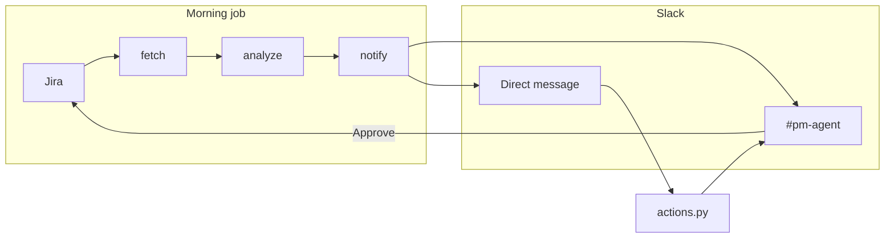

# Sentinel

Sentinel watches a Jira project and talks to the team in Slack. Each morning it posts a risk digest, sends each person a nudge about their own tasks, and reads comments for blockers. People can answer from Slack. Jira changes only after one approver confirms.

## Architecture

Two processes stay open. They share `.env` and `data/nudges.db`.



**Morning job** (`python src\morning.py`). A LangGraph graph with three nodes:

| Node | What it does |
| --- | --- |
| fetch | Loads Jira issues. Open issues include comment text. |
| analyze | Applies date rules in Python, then asks the model whether comments say the work is blocked. |
| notify | Posts one digest to the Slack channel and one direct message per person. |

Date rules never go through the model:

- **Overdue** — open task due before today
- **Due soon** — due today or within the next 2 days
- **Stale** — open task with no update for 3 days

The model does two jobs only: decide if comments say a task is blocked, and rewrite a nudge so it stays short. If the rewrite drops a task key, Sentinel sends the original text.

**Button listener** (`python src\actions.py`). Slack Socket Mode delivers clicks to this process. No public request URL is required.

| Click | What happens |
| --- | --- |
| Done | Asks for approval. Approve moves the Jira issue to Done. |
| Blocked | Asks for approval. Approve adds the comment “Marked blocked in Slack.” |
| Need more time | Asks for a new due date, then asks for approval. Approve sets that date on the Jira issue. |
| Reject | Leaves Jira unchanged. |

Only the Slack member in `SLACK_APPROVER_ID` can approve. Anyone in the channel can reject. A failed Jira write stays pending so it can be tried again.

Nudges are skipped from 9:00 PM to 8:00 AM India time, and each task is nudged at most once per day. Both limits are enforced in SQLite before Slack is called.

## Layout

| File | Role |
| --- | --- |
| `src/morning.py` | Runs the graph once, or every day at 9:00 AM India time |
| `src/agent.py` | LangGraph fetch → analyze → notify |
| `src/jira.py` | Reads issues and writes an approved decision |
| `src/risk.py` | Overdue, due-soon, and stale rules |
| `src/llm.py` | One completion call, OpenAI or Google |
| `src/digest.py` | Formats and posts the channel digest |
| `src/nudge.py` | Direct messages, quiet hours, and the once-a-day limit |
| `src/actions.py` | Slack buttons, approval, and the Socket Mode listener |
| `data/nudges.db` | Nudges already sent, button clicks, and pending approvals |

`python src\digest.py --daily` starts the same 9:00 job as `python src\morning.py --daily`.

## Setup

1. Copy `.env.example` to `.env`.
2. Create a Slack app with a bot token, an app-level token (`connections:write`) for Socket Mode, and the bot invited to `#pm-agent`.
3. Put your Slack member id in `SLACK_APPROVER_ID`. In Slack: profile, three dots, **Copy member ID**.
4. Fill in the Jira site, email, API token, and project key.
5. Set `OPENAI_API_KEY` or `GOOGLE_API_KEY`.

```powershell
py -3.12 -m venv .venv
.\.venv\Scripts\Activate.ps1
pip install -r requirements.txt
```

## Run

Leave these two windows open:

```powershell
python src\morning.py --daily
python src\actions.py
```

Run the morning job once, without waiting for 9:00:

```powershell
python src\morning.py
```

Other checks:

```powershell
python src\hello_slack.py
python src\jira.py
pytest
```
